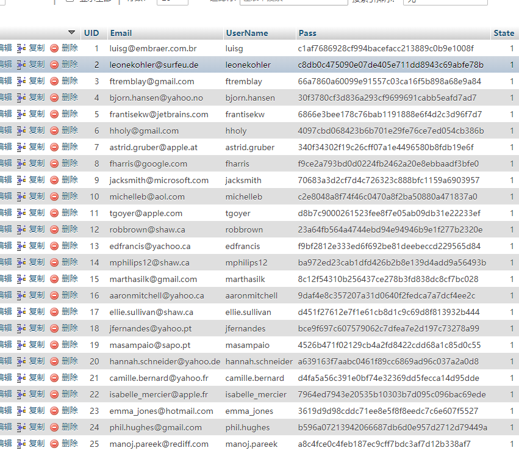
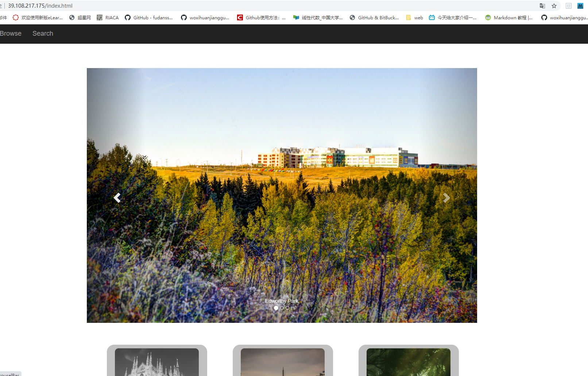
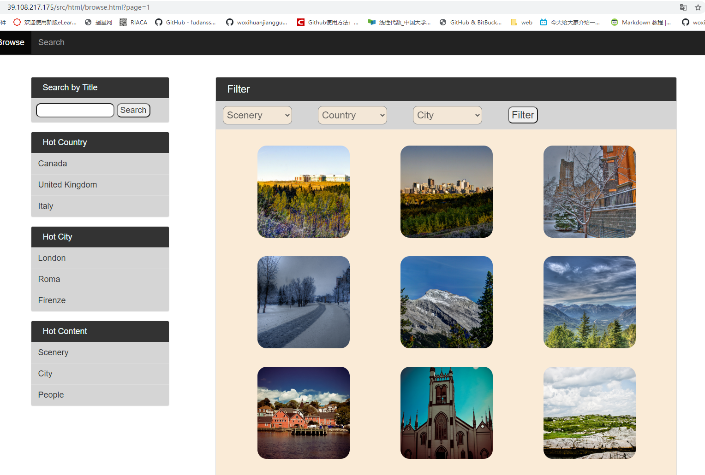
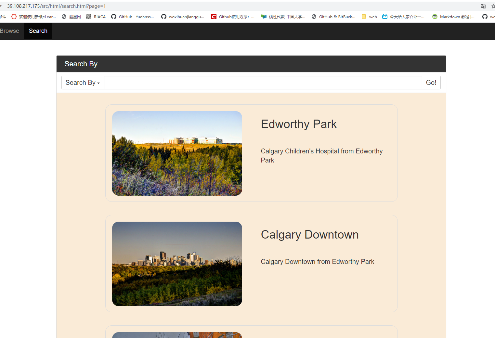

# Project2开发文档
## 个人信息
姓名：李臻欣  
学号：19302010007  
github地址：https://github.com/woxihuanjiangguo/2020WEB_PJ2  
网站入口:index.html
## 基本内容完成情况
所有功能都实现了！！  
  
整个PJ2采取了前后端完全分离的方式，用js中vue-resource的$http.post方式实现了前后端的交互，类似于jQuery的ajax。
 
一些需要加入主观设定的具体实现：  
1、主页中将喜欢数目最多的图片放在了轮播的头图中，一共有3张图片；9张缩略图为从数据库中随机读取的9张图片。刷新按钮点击时，头图不变，9张缩略图部分改变  
2、浏览页中的热门内容：对于图片类型content，取了三个固定的内容；对于热门国家与热门城市，从数据库中读取了现有图片数目最多的三个国家与三个城市，作为热门内容。  
3、注册的逻辑：用户名只能是字母、数字，介于3-20位之间，密码为6-18位的字母与数字，并且应该同时包含字母与数字，否则位弱密码，不能通过。  
4、上传界面：用户能够在已经选择图片的情况下，通过再次点击图片来更改所要上传的图片。并且在国家、城市的二级联动中，对于部分没有城市的国家，比如Netherlands Antilles,用户只需要选择国家即可；对于有城市的国家，用户需要同时选择国家和城市，否则不能通过。
用户必须填写标题与具体描述，否则视为不合法的图片内容。  
  
以下为一些网站截图  


## bonus完成情况
### bonus1

采用哈希加盐:盐采用的是用户名，将盐与密码拼接，并用sha1算法完成加密操作，再存储到数据库中。登陆时，将用户输入的密码同样进行一遍加盐、加密的操作，与数据库中的值进行比对。  
```php
$hashSaltPass = sha1($registerInfo['username'].$registerInfo['password']);
```
### bonus2
在服务器上部署了project，ip为39.108.217.175,可以完成pj的所有功能。主要问题是网速比较慢。  
过程是在服务器上配置好web环境，导入数据库，最后把pj文件夹上传到服务器中。



### bonus3
整个pj采用vue框架，来完成页面的渲染、数据的请求等前后端交互、响应的工作。以主页为例。
```javascript
var homeWhole = new Vue({
   el:'#homeWhole',
   data:{
       headPic:[],
       bodyPic:[],
   },
   methods:{
       refresh:function () {
            window.location.reload();
       },
       goTop:function(){
           document.body.scrollTop = document.documentElement.scrollTop = 0;
       },
       getHeadPic:function () {
            this.$http.post('src/php/module/homeHead.php','',{emulateJSON:true}).then(result=>{
                this.headPic = Object.values(result.body);
            });
       },
       getBodyPic:function () {
           this.$http.post('src/php/module/homeBody.php','',{emulateJSON:true}).then(result=>{
               this.bodyPic = Object.values(result.body);
           });
       },
       picJump:function (pid) {
            window.location = addUrl('src/html/detail.html'+(hasUrl?'?'+urlBack:''),'picId',pid);
       }
   },
   created:function () {
        this.getHeadPic();
        this.getBodyPic();
   },
});
```
vue对象中data为主页需要渲染的图片的数据，为两个数组，前者为头图、后者为9个缩略图，通过生命周期函数created，在页面刚创建但未渲染的时候，先完成一次对php文件的请求，得到用以渲染图片的数组数据。
```html
<div id="homeWhole">
    <div class="container" id="myCarousel">
        <div id="carouselBar" class="carousel slide">
            <ol class="carousel-indicators">
                <li data-target="#carouselBar" data-slide-to="0" class="active"></li>
                <li data-target="#carouselBar" data-slide-to="1"></li>
                <li data-target="#carouselBar" data-slide-to="2"></li>
            </ol>
            <div class="carousel-inner">
                <div class="item active">
                    
                    <div class="carousel-caption">{{headPic[0].title}}</div>
                </div>
                <div class="item">
                    
                    <div class="carousel-caption">{{headPic[1].title}}</div>
                </div>
                <div class="item">
                    
                    <div class="carousel-caption">{{headPic[2].title}}</div>
                </div>
            </div>
            <a href="#carouselBar" class="left carousel-control" data-slide="prev">
                <span class="glyphicon glyphicon-chevron-left"></span>
            </a>
            <a href="#carouselBar" class="right carousel-control" data-slide="next">
                <span class="glyphicon glyphicon-chevron-right"></span>
            </a>
        </div>
    </div>
    <!--小图部分-->
    <div  id="thumbnailPart">
        <div class="thumbnail" v-for="item in bodyPic">
            
            <div class="caption">
                <h3 class="text-center">{{item.title}}</h3>
                <p class="text-center">{{item.description}}</p>
            </div>
        </div>
    </div>
```
在html部分中，用v-bind指令与{{}}插值方法，将js中得到的数据渲染到dom中，完成显示。ps :为v-bind:的缩写
## 一些感想与建议
助教的文档写的很棒！
